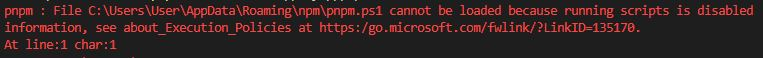
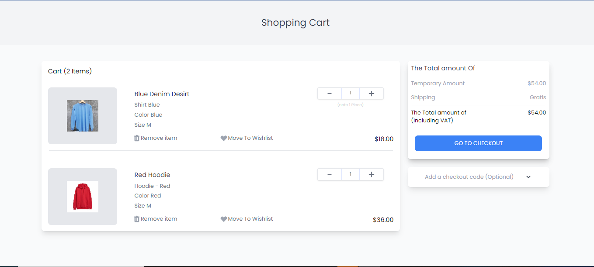

# Documentation React App With CRA   

<p align="center">
  
</p>

## Getting started

These instructions will get you through run of simulation react with CRA.

### Prerequisites

- Make sure that you have node js to installed in your device for run this application
  - Windows or macOS:
    [Install Node js Desktop](https://nodejs.org/en/download)
  - Linux: [Install Node js](https://nodejs.org/en/download)
- Download or see this [data](https://) and create the app like this.

### Running a sample

After you install Node js, run the file that you installed until the file that is installed is complete and check with:

```
node --version
```
or
```
node -v
```

After this you can clone myproject app with 

```
git clone "link of project"
```
```
For example:
git clone https://gitlab.com/haidar1802/myapp
```

After this,open your folder is already to clone in your device and install node modules with

```
npm install
```

so if dont wont to waiting along time with npm install so you can use 

```
pnpm install
```

but for the first you have run this code 
```
npm install -g pnpm
```

If you have the problem with the pnpm like this:



So you can look [this](https://lazyadmin.nl/powershell/running-scripts-is-disabled-on-this-system/) for fixed the problem

After this if you use pnpm in the app you can run with 
```
pnpm run start
```

or 

```
pnpm start
```

If you use npm in the app you can run app with 

```
npm run start
```
or 

```
npm start
```
So if you run this app the page applications you can see like this
 
### The Finish Of Decomentation :

### Create By : Muhammad Haidar Shahab

### So if you want know about me so you can see my profile:

[My Github](https://github.com/haidar180202) ( Have an problem ) 

[My Gitlab](https://gitlab.com/haidar1802/myapp)

[My Portfolio](https://profile-muhammad-haidar-shahab.netlify.app/)


### The technology use to create the application

            

